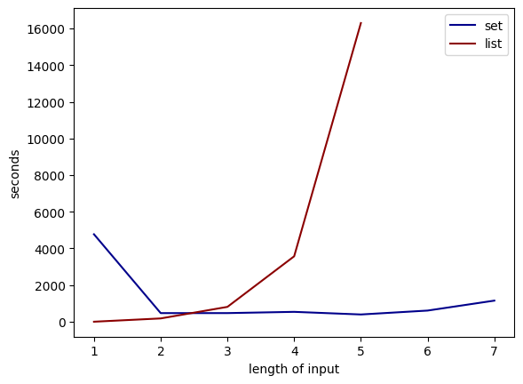
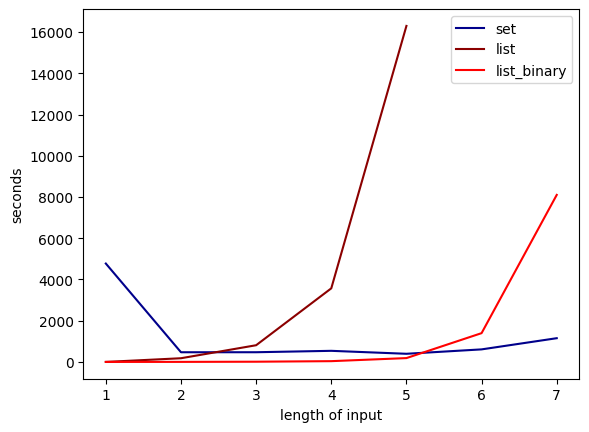
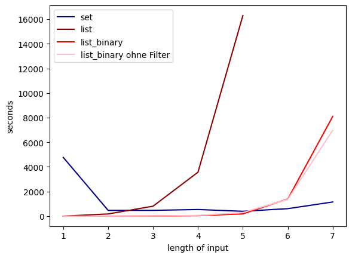
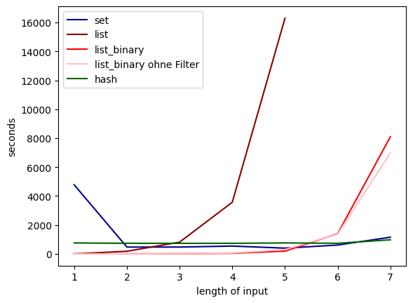

# Gruppenaufgabe: Effiziente Programmierung
## Aufgabe
Ihre Aufgabe ist das Verfassen eines kleinen Programms, welches einem Benutzer Lösungsvorschläge für das Brettspiel
Scrabble generiert.
Bei Scrabble gilt es aus einer Anzahl von Plättchen ein möglichst langes bzw. “gutes” Wort zu bilden. Jedes Plättchen
enthält dabei einen Buchstaben sowie eine Punktzahl. Ein “gutes” Wort ist demnach das Wort mit der maximal möglichen
Punktzahl aus allen aus den verfügbaren Plättchen bildbaren Wörter.
Hinweis: beim “echten” Scrabble müssten Sie noch die bereits auf dem Brett liegenden Plättchen mitbeachten, da Sie
ja an einem bestehenden Plättchen anlegen müssen. Für diese Aufgabe allerdings betrachten wir nur die Plättchen,
welche die Spielerin zur Verfügung hat.
Schreiben Sie also ein Programm welches:
1. Beim Start die weiter unten verlinkte Wortliste einliest und speichert
    - Experimentieren Sie dabei mit verschiedenen Containern (mehr dazu später)
2. Vom Benutzer (z.b. per input) einen String mit den verfügbaren Plättchen einlesen
    - Anschließend alle Permutationen von allen möglichen Teilmengen der Plättchenmenge bestimmen
    - Für jedes Ergebnis überprüfen, ob dieses ein deutsches Wort gemäß der Wortliste ergibt
    – Hinweis: Die unten verlinkte Liste enthält auch Abkürzungen, die normalerweise beim Scrabble nicht
    erlaubt wären. Für die Aufgabe ist dies jedoch irrelevant.
3. Eine nach Punkten sortierte Liste von legbaren Wörtern ausgeben.

## Code
Wir lesen die Wortliste ein und speichern sie zunächst als Set, um Duplikate zu vermeiden. Ausgegeben wird aber eine alphabetisch sortierte Liste.
```python
def get_wordlist():
    wordlist = set()
    with open("gruppenaufgabe\wordlist-german.txt", encoding="utf-8") as file:
        for word in file:
            word = word.lower().replace("\n", "")
            if len(word) <= 7:
                wordlist.add(word)
        return sorted(list(wordlist))
```

Danach kann man die verfügbaren Buchstaben als String eingeben (z.B. dlgohse). Für diese Buchstaben werden dann alle möglichen Permutationen aller Teilmengen bestimmt.
```python
def get_permutations(letters):
    combinations = []
    for i in range(1,len(letters)):
        for p in permutations(letters, r=i):
            combinations.append("".join(p))
    return combinations
```

<!---TODO: 
evtl. Permutationen mit Steinhaus-Johnson-Trotter-Algorithmus berechnen: O(n) statt O(n!) 
-->

Anschließend wird in der Wortliste nach jeder der Kombinationen gesucht und alle möglichen Wörter als Liste gespeichert und zurückgegeben.
Hier findet auch die Umwandlung der Wortliste in andere Container statt.
```python
def Suche_set(wordlist, combinations):
    wordlist = set(wordlist)
    combinations = get_permutations(letters)
    possible_words = {comb for comb in combinations if comb in wordlist}
    return possible_words
```

Schließlich werden für jedes mögliche Wort die Punkte berechnet und die Liste nach absteigend nach Punkten sortiert ausgegeben.
```python
def calc_points(possible_words):
    suggestions = []
    for word in possible_words:
        pts = 0
        for l in word:
            pts += points[l]
        suggestions.append((word,pts))
    return suggestions

def create_output(possible_words):
    suggestions = calc_points(possible_words)
    suggestions.sort(key=lambda x: x[1], reverse=True)
    for w, p in suggestions:
        print(w)
```

## Timing

Die Suche dauert länger, je mehr Kombinationen zu überprüfen sind. Da man beim Scrabble höchstens sieben Buchstaben zur Verfügung hat, haben wir die folgenden sieben Inputs ausgewählt.
- a
- se
- tro
- kleg
- cerkd
- enehcs 
- ührtsau

Für jeden dieser Inputs haben wir die Zeitmessung zunächst separat ausgeführt.

### timeit
Mit der `timeit.timeit`-Funktion kann man für kleine Code-Schnipsel Zeitmessungen machen. mit dem Argument globals, sorgt man dafür, dass auch Funktionen, die in der globalen Umgebung definiert sind, aufgerufen und Variablen übergeben werden können.
Da die einmalige Ausführung der Suchfunktionen bereits recht lange dauert, haben wir die Anzahl der Wiederholungen (`number`) im Vergleich zum Default reduziert.
```python
timeit.timeit('Suche_list(wordlist, combinations)', globals=globals(), number=100)
```
Damit erhielten wir folgende Ergebnisse in Sekunden:

|Input  |Liste   |Set    |
|---    |---     |---    |
|a      |0.08    |472.85 |
|es     |178.8   |469.4  |
|tro    |809.92  |470.33 |
|kleg   |3570.05 |538.26 |
|cerkd  |16300.54|394.9  |
|enehcs |       -|608.33 |
|ührtsau|       -|1151.08|



Da spätestens nach fünf Buchstaben klar war, dass die Laufzeit für die Liste exponentiell steigt, und bereits bei fünf Buchstaben 4.5 Stunden beträgt, haben wir die letzten beiden Inputs nur noch für das Set bestimmt.

Offensichtlich ist die Liste bei der linearen Suche schon ab 3 Buchstaben deutlich langsamer als das Set.
<!--TODO:
Warum?
-->

<!--TODO:
Warum sind die Ergebnisse beim Set so komisch? Evtl. nochmal laufen lassen
-->

## Verbesserungen der Laufzeit
Wir sehen drei Angriffspunkte für die Verbesserung der Laufzeit.
1. Die Wortliste, die durchsucht wird, ist sehr lang und kann durch geeignete Filter verkürzt werden.
2. Der Algorithmus für die Suche selbst kann verbessert werden.
3. Die Anzahl der Permutationen, die in der Liste gesucht werden müssen, kann reduziert werden.


### Filtern der Wortliste vor der Suche
Da nur Worte mit höchstens sieben Buchstaben gebildet werden können, filtern wir die Wortliste direkt beim Einlesen nach Wortlänge. Die Ergebnisse oben beinhalten diese Verbesserung bereits, da die Suche vorher zu lange gedauert hat.
<!--TODO:
Zeitmessung ohne diese Filterung für "a" im Vergleich?
-->

Wir haben vermutet, dass das Filtern der Liste schneller ist, als das Suchen und deshalb einen Filterungsschritt vor der Suche eingeführt, der nach der Länge des zu sucheden Wortes filtert.
<!--TODO:
Evtl. pro Wortlänge filtern, d.h. erst Permutationen der Länge 1 nur in Teil der Wortliste mit Länge 1 suchen.
-->


<!--TODO:
Ist Filterung der Liste nach Wörtern, die mind. einen der Buchstaben enthalten oder mit einem der Buchstaben beginnen, vor Suche hilfreich?
-->

### Binäre Suche
Im Vergleich zu Linear Suche mit Worst-Case-Laufzeit O(n), wie ursprünglich implemetiert, hat binäre Suche eine Worst-Case-Laufzeit von O(log n).

Da die Wortliste bereits alphabetisch sortiert ist, ist binäre Suche hier deutlich schneller

```python
def binäre_Suche(wordlist, comb):
    lower=0
    upper=len(wordlist)-1
    while lower < upper:
        m = floor((lower + upper)/2)
        if wordlist[m] < comb:
            lower = m + 1
        elif wordlist[m] > comb:
            upper = m - 1
        else:
            return True
    if wordlist[lower] == comb:
        return True
    else:
        return False
```

```python
def binäre_list(wordlist,combinations):
    possible_words = []
    for comb in combinations:
        if binäre_Suche(wordlist, comb):
            possible_words.append(comb)
    return possible_words
```

Mit vorheriger Filterung der Wortliste nach Wörtern mit höchstens 7 Buchstaben erhält man die folgenden Eregebnisse:


|Input  |Liste   |Liste Binär|Set    |
|---    |---     |---        |---    |
|a      |0.08    |0.04       |472.85 |
|es     |178.8   |2.04       |469.4  |
|tro    |809.92  |10.21      |470.33 |
|kleg   |3570.05 |37.13      |538.26 |
|cerkd  |16300.54|185.94     |394.9  |
|enehcs |       -|1396.12    |608.33 |
|ührtsau|       -|8102.49    |1151.08|

Offensichtlich ist binäre Suche für die Liste deutlich schneller. Außerdem ist die wächst die Laufzeit hier langsamer mit Länge des Inputs als bei der linearen Suche.
Allerdings ist die lineare Suche im Set für längere Inputs deutlich schneller. 



Wird die Wortliste vor der Suche nicht gefiltert, erhält man folgende Ergebnisse.

|Input  |Binär mit Filter|Binär ohne Filter|
|---    |---             |---              |
|a      |0.04            |0.04             |
|es     |2.04            |2.46             |
|tro    |10.21           |13.13            |
|kleg   |37.13           |58.72            |
|cerkd  |185.94          |294.04           |
|enehcs |1396.12         |1367.49          |
|ührtsau|8102.49         |6978.97          |



Hier spielt die Länge der Liste also eine kleinere Rolle in der Laufzeit.

Da Sets grundsätlich unsortiert sind, müsste es für binäre Suche wieder in eine Liste umgewandelt werden. Deshalb haben wir das nicht getestet.

### Hash-Table
Hierfür muss eigentlich zunächst eine Hash-Funktion definiert werden, mit der Keys für die Wörter aus der Wortliste erstellt werden. Zunächst haben wir versucht diesen Schritt zu überspringen bzw. die Wörter selbst als Keys abzuspeichern. Die entsprechende Suchfunktion muss dann nur überprüfen, ob eine mögliche Kombination in den Keys des Dictionary enthalten ist. Da diese als Hash-Table gespeichert sind und der Zugriff damit konstant sein sollte.

```python
def hash_search(wordlist, combinations):
    wordlist_dict = dict()
    wordlist = dict.fromkeys(wordlist)
    
    possible_words = []
    for comb in combinations:
        if comb in wordlist.keys():
            possible_words.append(comb)
    return possible_words
```
In unseren Ergebnissen spiegelt sich das allerdings nicht wieder:
|Input  |Liste   |Liste Binär|Set    |Dict  |
|---    |---     |---        |---    |---   |
|a      |0.08    |0.04       |472.85 |752.32|
|es     |178.8   |2.04       |469.4  |730.88|
|tro    |809.92  |10.21      |470.33 |727.43|
|kleg   |3570.05 |37.13      |538.26 |728.89|
|cerkd  |16300.54|185.94     |394.9  |755.53|
|enehcs |       -|1396.12    |608.33 |729.25|
|ührtsau|       -|8102.49    |1151.08|971.76|


<!--TODO:
Warum ???
-->

Daher haben wir versucht eine Hash-Funktion zu definieren.
```python
def hash_func(word):
    value = ''
    for letter in word:
        value += str(ord(letter))
    return int(value)
```

Nun kann die Wortliste in einem Dictionary gespeichert werden, dessen Keys mit der Hash-Funktion berechnet werden.
Danach kann für die Suche eines Wortes einfach der richtige Key aus dem Wort generiert werden. Damit kann direkt identifiziert werden, ob das Wort in der Wortliste ist.
Allerdings dauert das Umwandeln der Liste in ein Dictionary bzw. die Berechnung der Keys viel zu lange (mehrere Stunden).
Vermutlich kann das durch eine effizientere Hash-Funktion geändert werden, aber so konnten wir keine Zeitmessung durchführen.

```python
def hash_search(wordlist, combinations):
    wordlist_dict = dict()
    for word in wordlist:
        wordlist_dict[hash_func(word)] = word
    
    possible_words = []
    for comb in combinations:
        if hash_func(comb) in wordlist_dict.keys():
            possible_words.append(comb)
    return possible_words
```


### Filtern der Permutationen vor der Suche
Die Laufzeit der Suche hängt stark von der Länge n des Inputs ab. Da die Anzahl der Permutationen, also die Anzahl der Suchen, die durchgeführt werden müssen n! beträgt, ist es also sinnvoll die Anzahl der Permutationen, die tatsächlich überprüft werden, zu reduzieren.


<!--TODO:
Lösung finden
Mit und ohne Filterungen der Wortliste ausprobieren
Mit binärer und linear Suche ausprobieren
-->

### Anderer Ansatz: Sukzessives Filtern der Liste
Anstatt vorher alle Permutationen zu berechnen könnte man die Liste nach und nach nach Buchstaben filtern, sodass am Ende ausschließlich Wörter übrig bleiben, die keine Buchstaben enthalten, die nicht im Input enthalten sind.

<!--TODO:
Evtl. ausprobieren.
-->
